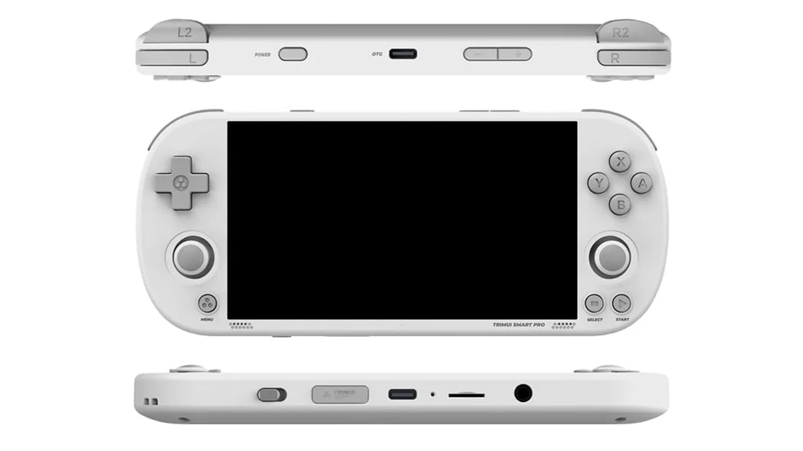

# Hardware Test Application for TrimUI Smart Pro

## Overview

Hardware Test Application that highlights pressed buttons and displays joystick crosshairs as you move them around.

You can also play a sound if you press MENU+SELECT.

To exit the app press MENU+START, or hold MENU+POWER for three seconds.

The latter option is the standard way to kill the currently running app on TSP.

## Prerequisites

This app has been developed and tested for CrossMix-OS (https://github.com/cizia64/CrossMix-OS)
Likewise it should work with the stock firmware or any other overlay OS (like CrossMix).

It is not designed for Knulli or launching from EmulationStation. Although theoretically, it should work there as well.

## Installation

1. Download HardwareTest.zip released here on GitHub.
2. Unzip it and copy all files with the folder (HardwareTest) to /mnt/SDCARD/Apps on your TSP.
3. Reboot TSP. HardwareTest app should appear in Apps.
4. If you plan to put this app somewhere else, don't forget to modify launch.sh

## Building

Basically, I use Ubuntu, Docker and Intellij GoLand. There is a Docker container running that I use for
cross-compilation.

1. You need to build the image (see https://github.com/geniot/trimui-smart-pro-toolchain), and start the container.
2. Run <code>make dist</code> to prepare the package. See the Makefile for details.
3. You can also deploy the app with make. This is the default <code>make</code> behavior that I use a lot during the
   development.

## Links

1. https://github.com/geniot/trimui-smart-pro-toolchain
2. https://github.com/gen2brain/raylib-go
3. https://github.com/trimui/firmware_smartpro
4. https://github.com/cizia64/CrossMix-OS

## License

You can use it freely for any purpose that you like. Most importantly, 
I hope it will help you to create something new and also share it on the internet.